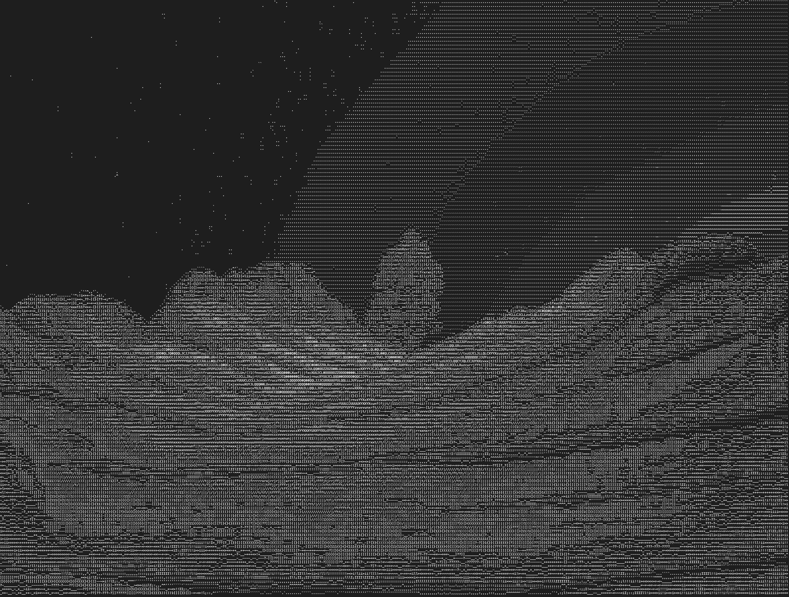
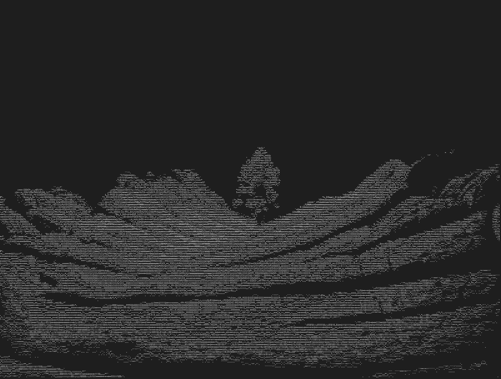
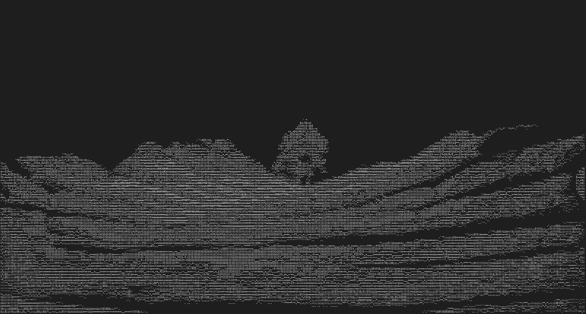
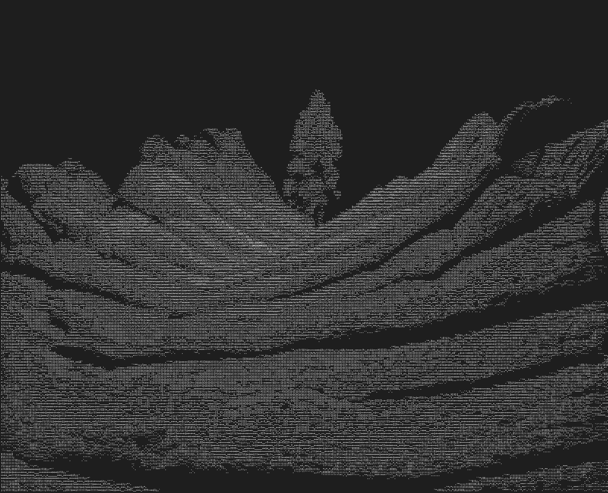

# cascii - Interactive ASCII Frame Generator

`cascii` is a high-performance, interactive tool for converting videos and image sequences into ASCII art frames.

When converting a video, the output files will be placed in a directory named after the video file. For example, `cascii my_video.mp4` will create a `my_video` directory.

## Features

- **Interactive Mode**: If you don't provide arguments, `cascii` will prompt you for them.
- **Flexible Input**: Works with video files or directories of PNGs.
- **Performance**: Uses `ffmpeg` for fast frame extraction and parallel processing with Rayon for ASCII conversion.
- **Video Segments**: Specify start and end times to convert only a portion of a video.
- **Presets**: `--small` and `--large` flags for quick quality adjustments.
- **Non-interactive Mode**: Use `--default` to run without prompts, using default values.

## Installation

An `install.sh` script is provided to build and install `cascii` to `/usr/local/bin`.

```bash
# Make sure you are in the cascii directory
./install.sh
```

You will be prompted for your password as it uses `sudo` to copy the binary.

## Usage

### cascii

#### Interactive

Run `cascii` without any arguments to be guided through the process:

```bash
cascii
```

It will first ask you to select an input file from the current directory, then prompt for the output directory, and finally for the quality settings.

#### With Arguments

You can also provide arguments directly:

```bash
# Basic usage with a video file
cascii my_video.mp4 --out ./my_frames

# Using presets
cascii my_video.mp4 --out ./my_frames --large

# Non-interactive mode (will fail if input is not provided)
cascii my_video.mp4 --out ./my_frames --default

# Convert a 5-second clip starting at 10 seconds into the video
cascii my_video.mp4 --start 00:00:10 --end 00:00:15
```

#### Options

- `[input]`: (Optional) The input video file or directory of images.
- `-o`, `--out`: (Optional) The output directory. Defaults to the current directory.
- `--columns`: (Optional) The width of the output ASCII art.
- `--fps`: (Optional) The frames per second to extract from a video.
- `--font-ratio`: (Optional) The aspect ratio of the font used for rendering.
- `--start`: (Optional) The start time for video conversion (e.g., `00:01:23.456` or `83.456`).
- `--end`: (Optional) The end time for video conversion.
- `--default`: Skips all prompts and uses default values for any missing arguments.
- `-s`, `--small`: Uses smaller default values for quality settings.
- `-l`, `--large`: Uses larger default values for quality settings.
- `-h`, `--help`: Shows the help message.
- `-V`, `--version`: Shows the version information.


### Examples:

#### Source image:


#### Test 1:

settings:

````
Luminance: 1
Font Ratio: 0.7
Columns: 400
````


#### Test 2:

settings:

````
Luminance: 35
Font Ratio: 0.7
Columns: 400
````


#### Test 3:

settings:

````
Luminance: 35
Font Ratio: 0.5
Columns: 400
````



#### Test 4:

settings:


````
Luminance: 35
Font Ratio: 1
Columns: 400
````



# Test Image

./target/release/ascii-gen \
  --input ./some_frames_dir \
  --out ../output/sunset_hl \
  --font-ratio 0.7

# Test Video

./target/release/ascii-gen \
  --input ../input.webm \
  --out ../output/sunset_hl \
  --columns 800 \
  --fps 30 \
  --font-ratio 0.7
